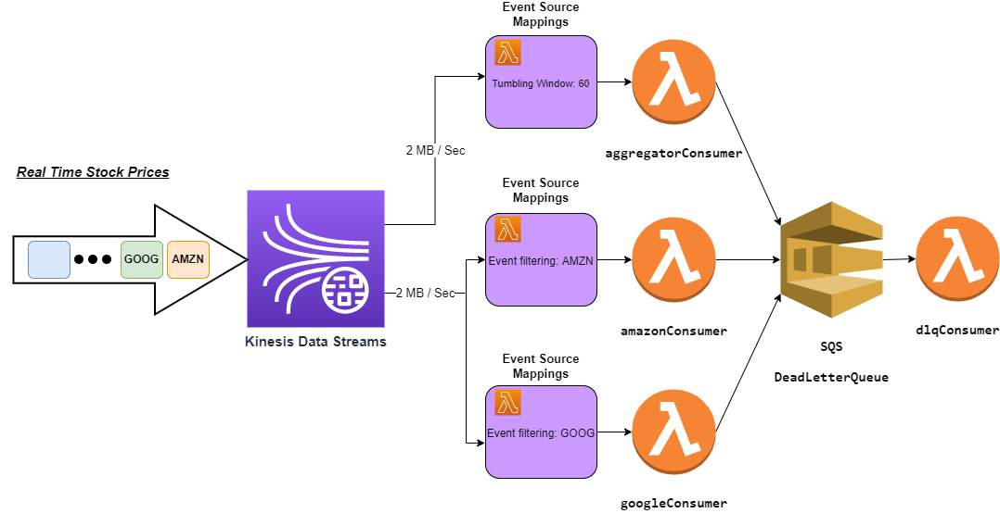

# using-aws-lambda-with-amazon-kinesis-serverless-framework-demo
**Using AWS Lambda with Amazon Kinesis Serverless Framework Demo**
## Video Tutorial
[](https://youtu.be/t6h32ccBxdM)

## Architecture


## Consumers (Lambda Functions)
### amazonConsumer
This consumer is defined as a shared throughput consumer, which means it shares the 2 MB throughput with all the other consumers in this case its the googleConsumer.</br>
The responsibility of this consumer is the get real time Amazon stock prices and decide if to buy or sell. </br>
The ability to filter events only with the AMZN ticker symbol is by using a FilterCriteria, </br>
it filters events before the invocation of the Lambda function.
### googleConsumer
This consumer has the same configuration as the amazonConsumer with one change, it filters events only with the GOOG ticker symbol.
###aggregatorConsumer
This consumer is defined as an enhanced fan-out consumer, which means it gets a dedicated throughput of 2 MB per second.</br>
The responsibility of this consumer is to calculate the average price of a stock in a time window of 60 seconds.</br>  
This is done by using the TumblingwindowInSeconds parameter which allows you to retain the state of your lambda function</br> 
between invocations in a time window of 60 seconds.
### dlqConsumer
Each one of the consumers described earlier are defined with an SQS queue OnFailure DestinationConfig.</br>
This configuration sets up the onFailure location for events to be sent to once it has reached the maximum</br>
number of times to retry when the function returns an error. Then Lambda will send some metadata about the failed batch to this destination.</br>
In order to process failed records from the SQS DeadLetterQueue I’ve defined a dlqConsumer Lambda function, </br>
This function will receive metadata about the failed batch and print it to cloudwatch.
### list event source mappings
`aws lambda list-event-source-mappings --function-name kinesis-consumer`
## Usage
### Deployment
In order to deploy the demo, you need to run the following command:
```
using-aws-lambda-with-amazon-kinesis-serverless-framework-demo/kinesis-consumers> npm i
using-aws-lambda-with-amazon-kinesis-serverless-framework-demo/kinesis-consumers> npm i -g serverless
using-aws-lambda-with-amazon-kinesis-serverless-framework-demo/kinesis-consumers> serverless deploy
```
### Publish Stock data records to Kinesis
```js
/**
 * Publish fake Google and Amazon stock prices to Kinesis Stream
 * @param  {Number} totalPublishTimeInSeconds - the total time duration to publish the records
 * @param  {Number} publishIntervalInMs - the time interval to publish records
 */
function publish(totalPublishTimeInSeconds, publishIntervalInMs){}
```
```
using-aws-lambda-with-amazon-kinesis-serverless-framework-demo/financial-data-publisher> npm i
using-aws-lambda-with-amazon-kinesis-serverless-framework-demo/financial-data-publisher> npm run produce
```
### View lambda logs
```
using-aws-lambda-with-amazon-kinesis-serverless-framework-demo/kinesis-consumers> serverless logs -f aggregatorConsumer -t
using-aws-lambda-with-amazon-kinesis-serverless-framework-demo/kinesis-consumers>  serverless logs -f amazonConsumer -t
using-aws-lambda-with-amazon-kinesis-serverless-framework-demo/kinesis-consumers> serverless logs -f googleConsumer -t
using-aws-lambda-with-amazon-kinesis-serverless-framework-demo/kinesis-consumers>  serverless logs -f dlqConsumer -t
```
### Cleanup
```
using-aws-lambda-with-amazon-kinesis-serverless-framework-demo/kinesis-consumers> serverless remove
```
## Links
This project is inspired by [Using AWS Lambda with Amazon Kinesis](https://docs.aws.amazon.com/lambda/latest/dg/with-kinesis.html)
\
Serverless Framework [Serverless Framework](https://www.serverless.com/framework/docs/getting-started), [Serverless Kinesis Streams](https://www.serverless.com/framework/docs/providers/aws/events/streams)
\
Node.js middleware engine for AWS Lambda [middy](https://middy.js.org/), [middy/event-normalizer](https://www.npmjs.com/package/@middy/event-normalizer)


